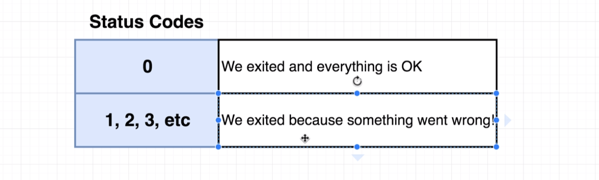
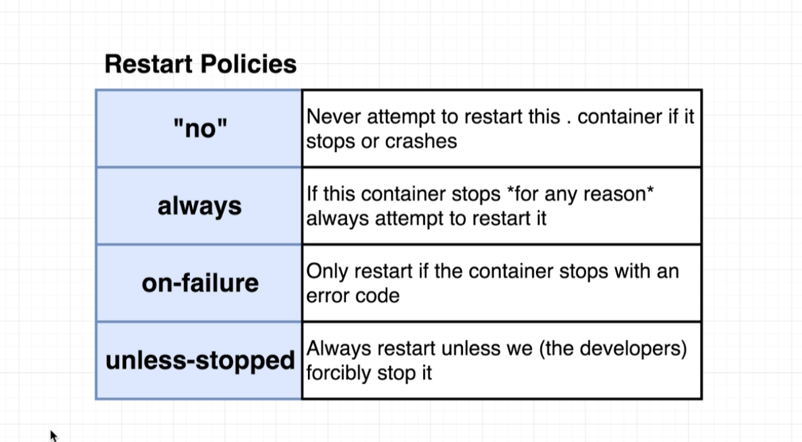

### CMD

---

```js
docker-compose up

// close and check
docker-compose down
docker ps

//
docker-compose up -d

// rebuild container
docker-compose up --build

```

### 重啟設定

---





因為 no 是 yml 的保留字，要另外括號。
