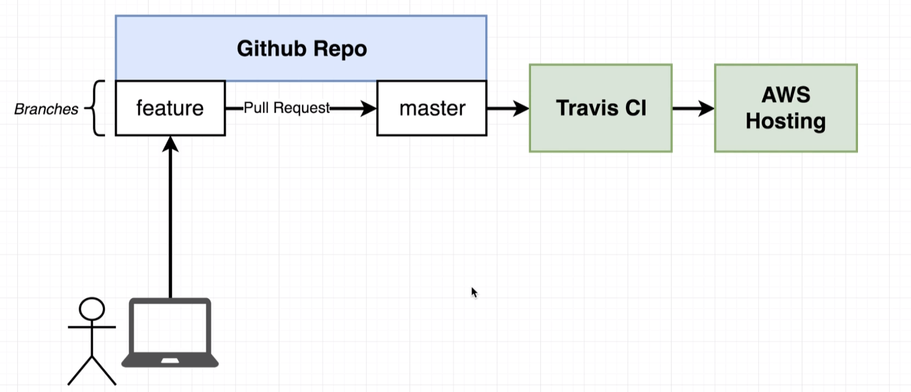
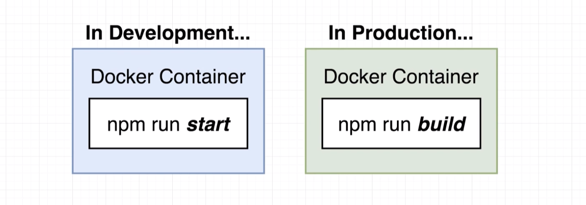
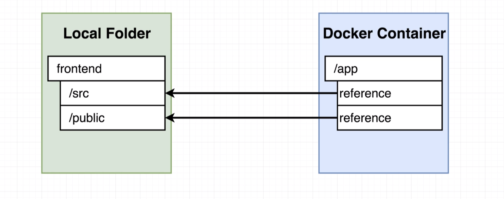
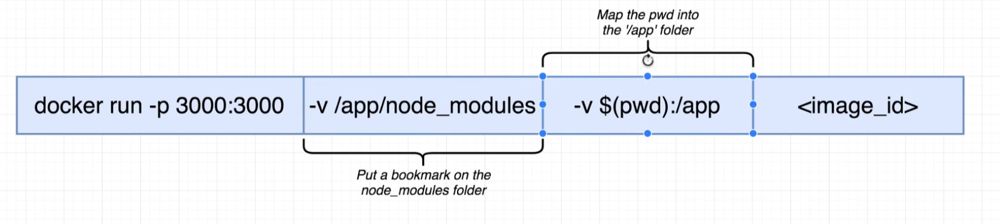
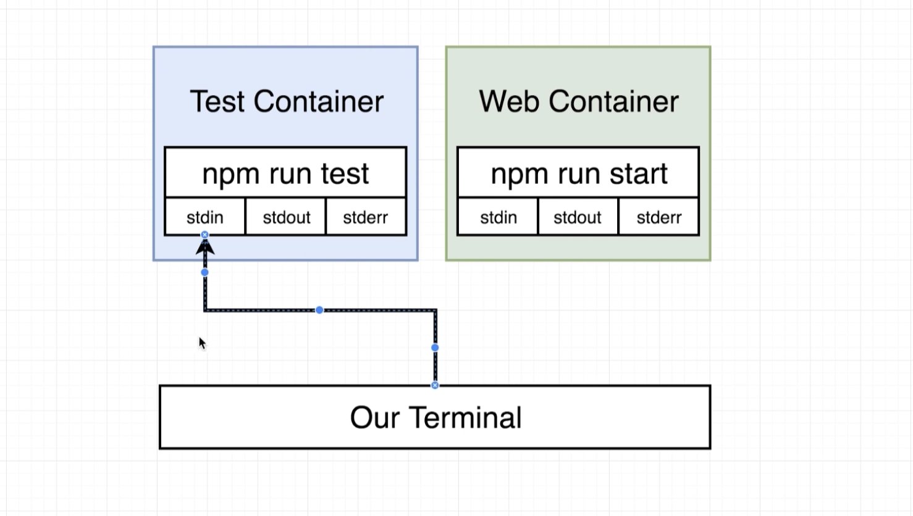
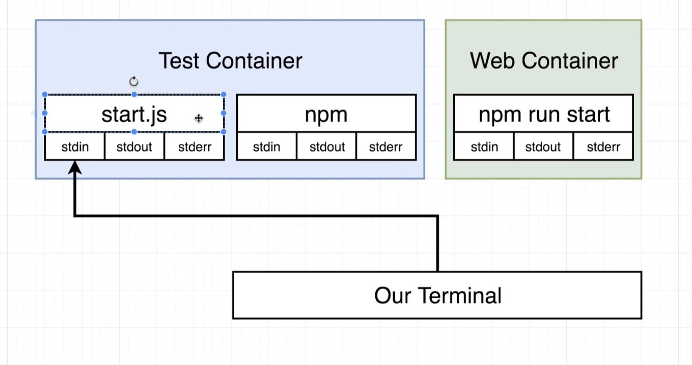
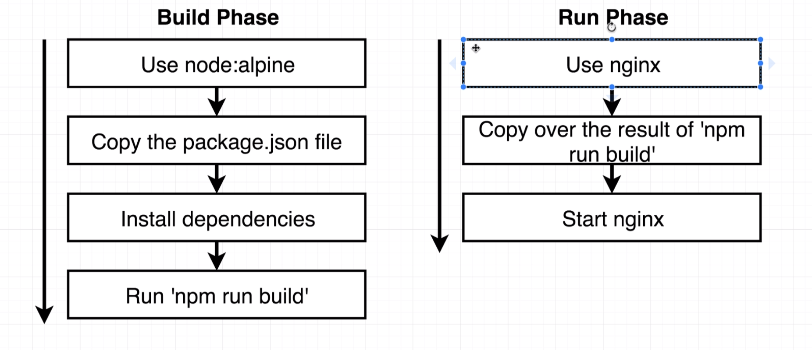
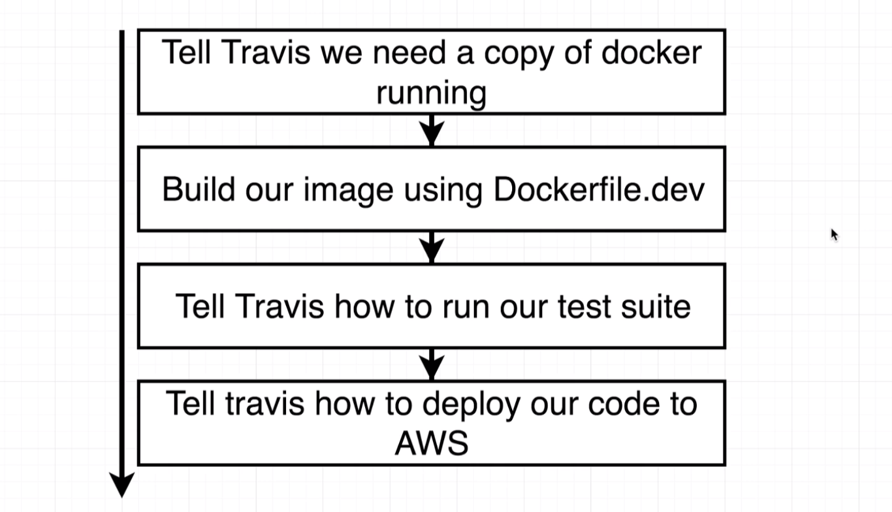

### 如何使用 travis CI 自動化測試及部署

---





```js
npx create-react-app frontend

// 指定檔案名稱
docker build -f Dockerfile.dev .

docker run -p 5001:3000 bc1cbf7e220a

// bind volume
// 用 reference 方式指向 local資料夾，而 node_modules 指向 docker 內
docker run -p 3000:3000 -v /app/node_modules -v $(pwd):/app a2ee37aae33e

// run test
docker run -it react-web npm run test

```




## Compose

- 使用 docker file 設定 volumes
- 使用 docker compose 另外啟動測試
- 使用 docker attach 連結輸入、輸出環境，但是會連接到 primary process，而不是 react test process





## Nginx

npm build 後，使用 nginx web server
https://hub.docker.com/_/nginx

```js
docker build .
docker run -p 8080:80 db2f661de73d //nginx 預設為80
```





[AWS Configuration Cheat Sheet](https://www.udemy.com/course/docker-and-kubernetes-the-complete-guide/learn/lecture/20676694#questions/17801350)

[github demo](https://github.com/kero13ro/travisCI-AWS-demo)
